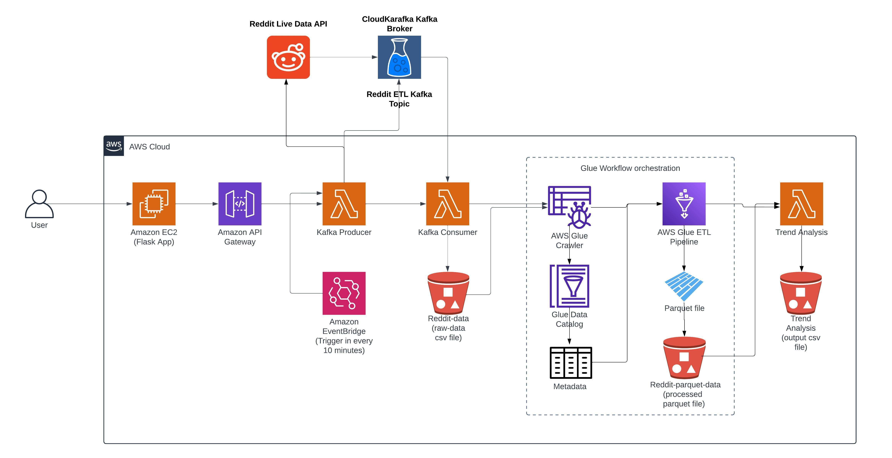

# Real-Time Reddit Data Orchestration and Trend Analysis Engine

This project demonstrates a real-time data pipeline for extracting data from Reddit, processing it, and performing trend analysis using AWS services. The system includes Lambda functions, AWS Glue for ETL jobs, Amazon S3 for storage, Kafka for data streaming, an API Gateway for user interaction and EC2 for compute.

## Architecture Overview



### Components:

- **EC2 Instance with Flask App:**
  - Amazon EC2 instance hosts a Flask web application.
  - Users interact with the application through the web interface.
  - Ports: 22, 5000, 80
  
- **API Gateway:**
  - Exposes endpoints for user interaction.
  - Connected to the EC2 instance for processing user requests.

- **Lambda Functions:**
  - **RedditToKafkaLambda1:**
    - Produces live data from Reddit API.
    - Streams data to Kafka consumers.
  - **RedditKafkaConsumer1:**
    - Consumes data from Kafka topics.
    - Stores data in Amazon S3 bucket "reddit-data".
  - **RedditTrendAnalysis1:**
    - Performs trend analysis on pre-processed data.
    - Stores results in "reddit-trend-out" S3 bucket.

- **Kafka (CloudKarafka):**
  - Used as the message broker for data streaming.
  - Kafka topic: "REDDIT_ETL_TOPIC".

- **Amazon S3:**
  - **Buckets:**
    - "reddit-data": Stores raw data from Kafka.
    - "reddit-data-parquet": Stores processed Parquet files.
    - "reddit-trend-out": Stores results of trend analysis.

- **AWS Glue:**
  - **Crawler:**
    - Gathers metadata from "reddit-data" S3 bucket.
    - Stores metadata in the "reddit-data" database.
  - **ETL Job (RedditCsvMappingParquetJob):**
    - Converts raw CSV data to Parquet format.
    - Mapping and transformation of data.
    - Stores output in "reddit-data-parquet" S3 bucket.
  - **Workflow (RedditWorkflow):**
    - Orchestrates the Glue Crawler and ETL Job for automation.

## Getting Started

### Prerequisites

- AWS account with necessary permissions.
- Python and pip installed locally for development.
- Access to the Reddit API for data extraction.
- Kafka setup with CloudKarafka.

### Installation

1. Clone the repository:

   ```bash
   git clone https://github.com/Kaushikdhola/RealTime-Reddit-Data-Orchestration.git

2. Install required Python packages:

    ```bash
    pip install -r requirements.txt

## Usage
 - Deploy the Flask application on an EC2 instance.
 - Configure the API Gateway endpoints.
 - Set up the necessary AWS services (Lambda functions, S3 buckets, Glue jobs, etc.).
 - Run the Lambda functions to start the data pipeline.
 - Interact with the Flask web app to trigger the data processing.

## AWS Services Used
 - Lambda
 - EC2
 - EventBridge
 - Glue (Crawler, Workflow, ETL Job)
 - Amazon S3
 - API Gateway

## Project Details

For a detailed overview and step-by-step guide for Data Streaming and ETL orchetration, please refer to my Medium article:

[Unleashing Real-time Insights: Building a Dynamic Reddit Data Pipeline with Kafka on AWS](https://medium.com/@kaushikdhola02/unleashing-real-time-insights-building-a-dynamic-reddit-data-pipeline-with-kafka-on-aws-c9d9ec73152c)

## Credits 
 Author: [Kaushik Chanabhai Dhola](https://github.com/Kaushikdhola)

## License
This project is licensed under the MIT License - see the [LICENSE](LICENSE) file for details.
